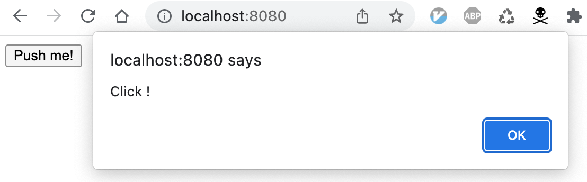

# use-global-instead

`import` が使えるのは、jsファイルを `<script type="module" src="...">` で読み込んだときだけなので、HTMLに直接書いたJavascriptから外部jsファイル内の関数をコールすることはできない。
なので、HTMLに直接書いたJavascriptから外部jsファイル内の関数をコールするときは、結局グローバル変数に出してそれを関数コールするしかなさそう。

以下は ES module を使わずに、グローバル変数を使うテスト。


[Javascript の Module 関数を htmlレベルから使いたい](https://teratail.com/questions/261118) を参考。

# 確認

```
$ cd shakyo-es-Module
$ python -m http.server 8080
```



# メモ

## ファイルの関連
```
index.html
    <head>
      <script type="module" src="src/main.js"></script>
      ↓
src/main.js
    const click_handler = function() {
        alert('Click !');
    };

    window.click_handler = click_handler;
      ↓
index.html
    <body>
    <button type="button" onclick="click_handler();">Push me!</button>
```
